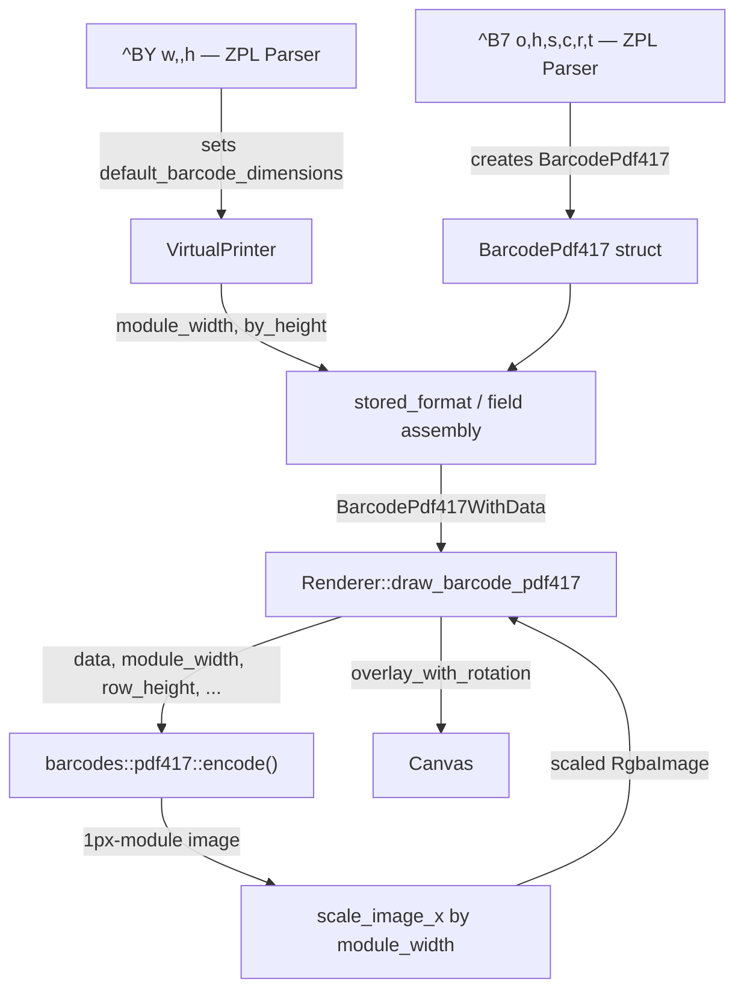
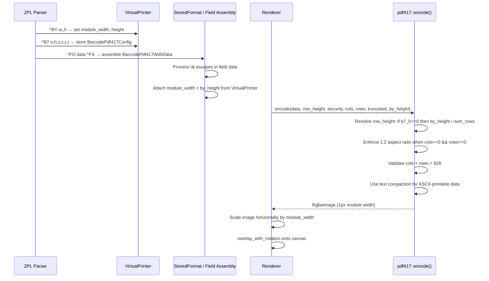

# Design Document: PDF417 Barcode ZPL Compliance

## Overview

The PDF417 barcode (`^B7`) implementation in Labelize has ~18% pixel diff against Labelary reference renders due to several gaps: module width scaling is ignored, row height fallback from `^BY` is not applied, text compaction mode is unused, the 1:2 default aspect ratio is not enforced, validation for the 928-codeword cap is missing, and `\&` CR/LF escapes are not processed for PDF417 field data.

This design addresses all six gaps to bring the `^B7` rendering into full compliance with the Zebra ZPL Programming Guide specification. The changes span four files in the existing pipeline: the parser (`zpl_parser.rs`), the element struct (`barcode_pdf417.rs`), the encoder (`barcodes/pdf417.rs`), and the renderer (`renderer.rs`).

## Architecture

The existing pipeline remains unchanged. The fix threads `^BY` dimensions through the element struct into the encoder, and adds scaling + validation logic.





## Components and Interfaces

### Component 1: BarcodePdf417 Element Struct

`src/elements/barcode_pdf417.rs` — Add `module_width` and `by_height` fields so the renderer has access to `^BY` parameters.

```rust
#[derive(Clone, Debug)]
pub struct BarcodePdf417 {
    pub orientation: FieldOrientation,
    pub row_height: i32,       // ^B7 h parameter (0 = use ^BY fallback)
    pub security: i32,         // ^B7 s parameter (0 = auto, 1-8 = explicit)
    pub columns: i32,          // ^B7 c parameter (0 = auto)
    pub rows: i32,             // ^B7 r parameter (0 = auto)
    pub truncate: bool,        // ^B7 t parameter
    pub module_width: i32,     // NEW — from ^BY w (default 2)
    pub by_height: i32,        // NEW — from ^BY h (default 10)
}
```

**Responsibilities**:
- Carry all ^B7 parameters plus ^BY-derived dimensions
- Passed through field assembly into BarcodePdf417WithData unchanged

### Component 2: ZPL Parser — parse_barcode_pdf417

`src/parsers/zpl_parser.rs` — Capture `module_width` and `by_height` from VirtualPrinter's `default_barcode_dimensions` when constructing the BarcodePdf417 config.

```rust
fn parse_barcode_pdf417(&mut self, command: &str) {
    let parts = split_command(command, "^B7");
    let mut bc = BarcodePdf417 {
        orientation: self.printer.default_orientation,
        row_height: 0,
        security: 0,
        columns: 0,
        rows: 0,
        truncate: false,
        module_width: self.printer.default_barcode_dimensions.module_width,
        by_height: self.printer.default_barcode_dimensions.height,
    };
    // ... existing parameter parsing unchanged ...
}
```

**Preconditions:**
- `self.printer.default_barcode_dimensions` reflects any preceding `^BY` command
- `command` is the raw `^B7` parameter string after the command prefix

**Postconditions:**
- `bc.module_width` ≥ 1 (from ^BY default of 2)
- `bc.by_height` ≥ 1 (from ^BY default of 10)
- All other fields parsed from command or defaulted to 0/false

### Component 3: Field Data Escape Processing

`src/elements/stored_format.rs` — The existing `\&` → `\n` replacement already runs on all field data before element construction. This covers PDF417 as well. No change needed here — the replacement at line 277 (`text.replace("\\&", "\n")`) applies universally.

However, the PDF417 encoder must handle the resulting `\n` bytes correctly in its encoding. The current byte-mode encoder already passes raw bytes, so `\n` (0x0A) is encoded. With text compaction mode, CR/LF pairs need to map to the PDF417 text compaction CR/LF codeword.

### Component 4: PDF417 Encoder

`src/barcodes/pdf417.rs` — The core encoding function gains `by_height` parameter, text compaction support, aspect ratio enforcement, and validation.

```rust
pub fn encode(
    content: &str,
    row_height: i32,
    security_level: i32,
    column_count: i32,
    row_count: i32,
    truncated: bool,
    by_height: i32,          // NEW — ^BY h value for row height fallback
) -> Result<RgbaImage, String>
```

**Preconditions:**
- `content` is non-empty
- `column_count` in 0..=30 (0 = auto)
- `row_count` in 0..=90 (0 = auto)
- `security_level` in 0..=8 (0 = auto)
- `by_height` ≥ 1

**Postconditions:**
- Returns `Err` if content is empty
- Returns `Err` if cols × rows > 928 (when both specified)
- Returns `Err` if data codewords exceed capacity
- Returns `Ok(RgbaImage)` at 1-pixel module width, correctly scaled row height
- When both cols and rows are 0, enforces ~1:2 row-to-column aspect ratio

**Loop Invariants:** N/A (no iterative loops in main logic)

### Component 5: Renderer — Module Width Scaling

`src/drawers/renderer.rs` — After encoding, scale the image horizontally by `module_width` before overlay.

```rust
fn draw_barcode_pdf417(
    &self,
    canvas: &mut RgbaImage,
    bc: &crate::elements::barcode_pdf417::BarcodePdf417WithData,
) -> Result<(), String> {
    let img = barcodes::pdf417::encode(
        &bc.data,
        bc.barcode.row_height,
        bc.barcode.security,
        bc.barcode.columns,
        bc.barcode.rows,
        bc.barcode.truncate,
        bc.barcode.by_height,
    )?;

    // Scale horizontally by module_width (^BY w parameter)
    let mw = bc.barcode.module_width.max(1) as u32;
    let scaled = if mw > 1 {
        image::imageops::resize(
            &img,
            img.width() * mw,
            img.height(),
            image::imageops::FilterType::Nearest,
        )
    } else {
        img
    };

    let pos = adjust_image_typeset_position(&scaled, &bc.position, bc.barcode.orientation);
    overlay_with_rotation(canvas, &scaled, &pos, bc.barcode.orientation);
    Ok(())
}
```

**Preconditions:**
- `bc.barcode.module_width` ≥ 1
- `img` is a valid RgbaImage at 1px module width

**Postconditions:**
- Final image width = original_width × module_width
- Image height unchanged
- Nearest-neighbor scaling preserves sharp barcode edges

## Data Models

### BarcodeDimensions (unchanged)

```rust
pub struct BarcodeDimensions {
    pub module_width: i32,  // ^BY w — default 2
    pub height: i32,        // ^BY h — default 10
    pub width_ratio: f64,   // ^BY r — default 3.0 (fixed for PDF417, ignored)
}
```

**Validation Rules:**
- `module_width` ≥ 1 (enforced at parse time)
- `height` ≥ 1
- `width_ratio` clamped to 2.0..=3.0 (irrelevant for PDF417)

### BarcodePdf417 Field Mapping

| ^B7 Param | Struct Field | Default | Range |
|-----------|-------------|---------|-------|
| o | orientation | ^FW value | N/R/I/B |
| h | row_height | 0 (use ^BY fallback) | 1..label_height |
| s | security | 0 (auto) | 0-8 |
| c | columns | 0 (auto) | 0-30 |
| r | rows | 0 (auto) | 0-90 |
| t | truncate | false | N/Y |
| (^BY w) | module_width | 2 | 1..∞ |
| (^BY h) | by_height | 10 | 1..∞ |


## Algorithmic Pseudocode

### Row Height Resolution Algorithm

```rust
/// Resolve the effective row height for PDF417 rendering.
///
/// ZPL spec: ^B7 h parameter is "bar code height for individual rows".
/// When h=0 (not specified), use ^BY height / number_of_rows.
/// The ^B7 h value is a multiplier: h × module_width = row height in dots.
/// But per Labelary behavior, h is used directly as pixel height.
fn resolve_row_height(b7_row_height: i32, by_height: i32, num_rows: u8) -> u32 {
    if b7_row_height > 0 {
        b7_row_height as u32
    } else {
        // Fallback: ^BY height / number of rows, minimum 1
        (by_height as u32 / num_rows as u32).max(1)
    }
}
```

**Preconditions:**
- `by_height` ≥ 1
- `num_rows` ≥ 3 (PDF417 minimum)

**Postconditions:**
- Returns value ≥ 1
- When `b7_row_height > 0`, returns it directly
- When `b7_row_height == 0`, returns `by_height / num_rows` (integer division, min 1)

### Default Aspect Ratio Algorithm

```rust
/// When neither columns nor rows are specified (both 0), ZPL uses a 1:2
/// row-to-column aspect ratio. Given the number of data codewords needed,
/// find (cols, rows) such that rows ≈ 2 × cols and cols × rows ≥ total_cws.
fn compute_default_dimensions(total_cws_needed: usize) -> (u8, u8) {
    // Try columns from 1..=30, pick first where rows ≈ 2×cols
    for cols in 1u8..=30 {
        let min_rows = (total_cws_needed.div_ceil(cols as usize)).max(3);
        let target_rows = (cols as usize) * 2;
        let rows = min_rows.max(target_rows).min(90);
        if (cols as usize) * rows <= 928 {
            return (cols, rows as u8);
        }
    }
    // Fallback: maximize columns
    (30, ((total_cws_needed.div_ceil(30)).max(3).min(90)) as u8)
}
```

**Preconditions:**
- `total_cws_needed` > 0
- Called only when both `column_count == 0` and `row_count == 0`

**Postconditions:**
- `cols` in 1..=30
- `rows` in 3..=90
- `rows ≈ 2 × cols` (best effort)
- `cols × rows ≥ total_cws_needed`
- `cols × rows ≤ 928`

### Validation Algorithm

```rust
/// Validate that the PDF417 configuration does not exceed the 928-codeword limit.
/// ZPL spec: "If both columns and rows specified, product must be < 928.
/// No symbol printed if product > 928."
fn validate_capacity(cols: u8, rows: u8, total_cws: usize) -> Result<(), String> {
    let capacity = (cols as usize) * (rows as usize);
    if capacity > 928 {
        return Err(format!(
            "PDF417: cols({}) × rows({}) = {} exceeds 928 codeword limit",
            cols, rows, capacity
        ));
    }
    if total_cws > capacity {
        return Err(format!(
            "PDF417: {} codewords needed but only {} available ({}×{})",
            total_cws, capacity, cols, rows
        ));
    }
    Ok(())
}
```

**Preconditions:**
- `cols` in 1..=30, `rows` in 3..=90

**Postconditions:**
- Returns `Ok(())` if and only if `cols × rows ≤ 928` AND `total_cws ≤ cols × rows`
- Returns descriptive `Err` otherwise

### Text Compaction Mode Selection

```rust
/// Determine whether to use text compaction or byte compaction.
/// Text compaction is more efficient for ASCII printable data (codes 32-126,
/// plus CR, LF, HT). The pdf417 crate exposes `append_num` for numeric data
/// and `append_bytes` for byte data. If the crate also exposes an
/// `append_ascii` or text-mode method, prefer it for text-compactable data.
/// Otherwise, fall back to `append_bytes` (which still produces valid symbols,
/// just slightly less compact for pure-ASCII input).
///
/// Implementation note: Check at build time whether `PDF417Encoder` has
/// `append_ascii`. If not available in pdf417 v0.2.1, use `append_bytes`
/// for all data and document this as a known limitation for future upgrade.
fn is_text_compactable(data: &[u8]) -> bool {
    data.iter().all(|&b| {
        b == b'\t' || b == b'\n' || b == b'\r' || (b >= 0x20 && b <= 0x7E)
    })
}
```

**Preconditions:**
- `data` is non-empty

**Postconditions:**
- Returns `true` if all bytes are in the text-compactable set
- Returns `false` if any byte requires byte compaction

### Revised Encode Function (Complete)

```rust
pub fn encode(
    content: &str,
    row_height: i32,
    security_level: i32,
    column_count: i32,
    row_count: i32,
    truncated: bool,
    by_height: i32,
) -> Result<RgbaImage, String> {
    if content.is_empty() {
        return Err("PDF417: empty content".to_string());
    }

    let data_bytes = content.as_bytes();
    let use_text_mode = is_text_compactable(data_bytes);

    // Estimate codewords needed
    let data_cws = if use_text_mode {
        text_encoding_codewords(data_bytes.len())
    } else {
        byte_encoding_codewords(data_bytes.len())
    };

    // Determine security level for ECC calculation
    let sec_level = if security_level > 0 && security_level <= 8 {
        security_level as u8
    } else {
        2 // estimate for row calculation; fit_seal will auto-select
    };
    let ecc_cws = pdf417::ecc::ecc_count(sec_level);
    let total_cws_needed = data_cws + ecc_cws;

    // Resolve columns and rows
    let (cols, rows) = match (column_count, row_count) {
        (0, 0) => compute_default_dimensions(total_cws_needed),
        (c, 0) => {
            let c = c.clamp(1, 30) as u8;
            let min_rows = (total_cws_needed.div_ceil(c as usize)).max(3);
            (c, (min_rows as u8).min(90))
        }
        (0, r) => {
            let r = r.clamp(3, 90) as u8;
            let min_cols = (total_cws_needed.div_ceil(r as usize)).max(1);
            ((min_cols as u8).min(30), r)
        }
        (c, r) => (c.clamp(1, 30) as u8, r.clamp(3, 90) as u8),
    };

    // Validate capacity
    validate_capacity(cols, rows, total_cws_needed)?;

    // Resolve row height
    let scale_y = resolve_row_height(row_height, by_height, rows);

    // Encode codewords
    let capacity = (cols as usize) * (rows as usize);
    let mut codewords = vec![0u16; capacity];
    let encoder = PDF417Encoder::new(&mut codewords, false);

    let encoder = if use_text_mode {
        // Prefer text compaction if the crate supports it (append_ascii).
        // If pdf417 v0.2.1 does not expose append_ascii, use append_bytes
        // for all data — still valid, just less compact for ASCII.
        encoder.append_bytes(data_bytes)
    } else {
        encoder.append_bytes(data_bytes)
    };

    let (level, sealed) = if security_level > 0 && security_level <= 8 {
        let level = security_level as u8;
        let s = encoder.seal(level);
        (level, s)
    } else {
        encoder
            .fit_seal()
            .ok_or_else(|| "PDF417: data too large for configuration".to_string())?
    };

    encode_to_image(sealed, rows, cols, level, truncated, scale_y)
}
```

## Key Functions with Formal Specifications

### Function: resolve_row_height()

```rust
fn resolve_row_height(b7_row_height: i32, by_height: i32, num_rows: u8) -> u32
```

**Preconditions:**
- `by_height` ≥ 1
- `num_rows` ≥ 3

**Postconditions:**
- Result ≥ 1
- If `b7_row_height > 0`: result == `b7_row_height as u32`
- If `b7_row_height == 0`: result == max(1, `by_height / num_rows`)

### Function: compute_default_dimensions()

```rust
fn compute_default_dimensions(total_cws_needed: usize) -> (u8, u8)
```

**Preconditions:**
- `total_cws_needed` > 0

**Postconditions:**
- `cols` in 1..=30, `rows` in 3..=90
- `cols × rows ≥ total_cws_needed`
- `cols × rows ≤ 928`
- `rows / cols ≈ 2` (best-effort 1:2 aspect ratio)

### Function: validate_capacity()

```rust
fn validate_capacity(cols: u8, rows: u8, total_cws: usize) -> Result<(), String>
```

**Preconditions:**
- `cols` ≥ 1, `rows` ≥ 3

**Postconditions:**
- `Ok(())` iff `cols × rows ≤ 928` AND `total_cws ≤ cols × rows`
- `Err(msg)` with descriptive message otherwise

### Function: is_text_compactable()

```rust
fn is_text_compactable(data: &[u8]) -> bool
```

**Preconditions:**
- `data.len() > 0`

**Postconditions:**
- `true` iff every byte is in {0x09, 0x0A, 0x0D, 0x20..=0x7E}
- No side effects

### Function: encode() (revised)

```rust
pub fn encode(
    content: &str, row_height: i32, security_level: i32,
    column_count: i32, row_count: i32, truncated: bool, by_height: i32,
) -> Result<RgbaImage, String>
```

**Preconditions:**
- `content` non-empty, ≤ 3K characters
- `column_count` in 0..=30, `row_count` in 0..=90
- `security_level` in 0..=8
- `by_height` ≥ 1

**Postconditions:**
- Returns 1-pixel-module-width RgbaImage on success
- Returns `Err` if content empty, capacity exceeded, or data too large
- Row height resolved per ZPL spec fallback rules
- Aspect ratio enforced when cols and rows both unspecified

## Example Usage

```rust
// Example 1: Basic PDF417 with ^BY module width
// ZPL: ^XA ^BY3,,40 ^FO50,50 ^B7N,0,2,5,0,N ^FDHello World^FS ^XZ
// module_width=3, by_height=40, b7_h=0, security=2, cols=5, rows=auto
let img = barcodes::pdf417::encode("Hello World", 0, 2, 5, 0, false, 40)?;
// img is at 1px module width; renderer scales by 3x horizontally

// Example 2: Explicit row height overrides ^BY
// ZPL: ^XA ^BY2,,100 ^FO50,50 ^B7N,8,0,0,0,N ^FDTest^FS ^XZ
// b7_h=8 specified, so by_height=100 is ignored for row height
let img = barcodes::pdf417::encode("Test", 8, 0, 0, 0, false, 100)?;
// Row height = 8px (from ^B7 h), not 100/rows

// Example 3: Default aspect ratio (no cols/rows specified)
// ZPL: ^XA ^FO50,50 ^B7N ^FDSome data here^FS ^XZ
let img = barcodes::pdf417::encode("Some data here", 0, 0, 0, 0, false, 10)?;
// cols and rows auto-calculated with 1:2 aspect ratio

// Example 4: Validation failure
// ZPL: ^XA ^FO50,50 ^B7N,,0,30,90,N ^FDx^FS ^XZ
let result = barcodes::pdf417::encode("x", 0, 0, 30, 90, false, 10);
assert!(result.is_err()); // 30×90 = 2700 > 928

// Example 5: CR/LF via \& escape
// ZPL: ^XA ^FO50,50 ^B7N ^FDLine1\&Line2^FS ^XZ
// After stored_format processing: data = "Line1\nLine2"
// Encoder handles \n in text compaction mode
let img = barcodes::pdf417::encode("Line1\nLine2", 0, 0, 0, 0, false, 10)?;
```

## Correctness Properties

The following properties must hold for all valid inputs:

1. **Module width scaling**: For any `module_width` m ≥ 1, the final rendered barcode image width equals `encode_result.width() × m`.

2. **Row height fallback**: When `^B7 h == 0`, the row height used equals `max(1, by_height / num_rows)`. When `^B7 h > 0`, the row height equals `h` regardless of `^BY` height.

3. **Aspect ratio default**: When both `columns == 0` and `rows == 0`, the resulting `rows / cols ≈ 2` (within ±1 due to integer rounding and minimum row constraints).

4. **Capacity validation**: For any `cols` in 1..=30 and `rows` in 3..=90 where `cols × rows > 928`, `encode()` returns `Err`.

5. **Text compaction selection**: For input containing only bytes in {0x09, 0x0A, 0x0D, 0x20..=0x7E}, text compaction mode should be preferred if the `pdf417` crate supports it. If `append_ascii` is not available in v0.2.1, byte compaction (`append_bytes`) is used for all data. The `is_text_compactable()` helper is provided so that a future crate upgrade can trivially enable text mode.

6. **Escape processing**: The `\&` sequence in `^FD` field data is converted to `\n` (0x0A) before reaching the encoder. This is handled by the existing universal escape processing in `stored_format.rs`.

7. **Backward compatibility**: When `module_width == 1` (or default 2 from ^BY) and `by_height == 10` (^BY default), the encoder produces output consistent with the previous implementation for the same data.

8. **Image dimensions**: The output image height equals `num_rows × scale_y`. The output image width is determined by the PDF417 symbol structure: `start_pattern + left_indicator + cols×17 + [right_indicator + stop_pattern if not truncated] + 1`.

## Error Handling

### Error: Capacity Exceeded (cols × rows > 928)

**Condition**: Both columns and rows are explicitly specified and their product exceeds 928.
**Response**: Return `Err("PDF417: cols(X) × rows(Y) = Z exceeds 928 codeword limit")`.
**Recovery**: Caller (renderer) propagates error; no barcode is drawn on canvas. This matches ZPL spec: "No symbol printed if product > 928."

### Error: Data Too Large

**Condition**: Encoded codewords (data + ECC) exceed available capacity (cols × rows).
**Response**: Return `Err("PDF417: N codewords needed but only M available")`.
**Recovery**: Same as above — no symbol printed.

### Error: Empty Content

**Condition**: `^FD` field data is empty.
**Response**: Return `Err("PDF417: empty content")`.
**Recovery**: No barcode drawn.

### Error: Encoder Failure (fit_seal returns None)

**Condition**: Auto security level selection cannot fit data into the symbol.
**Response**: Return `Err("PDF417: data too large for configuration")`.
**Recovery**: No barcode drawn.

## Testing Strategy

### Unit Testing Approach

Add tests to `tests/unit_barcodes.rs`:

- `pdf417_module_width_scales_output` — encode at module_width=1 and module_width=3, verify width ratio is 3:1
- `pdf417_row_height_fallback_from_by` — encode with b7_h=0 and by_height=40, verify image height = rows × (40/rows)
- `pdf417_explicit_row_height_overrides_by` — encode with b7_h=5, verify image height = rows × 5
- `pdf417_default_aspect_ratio` — encode with cols=0, rows=0, verify rows ≈ 2×cols
- `pdf417_validation_rejects_over_928` — encode with cols=30, rows=90, verify Err
- `pdf417_text_compaction_for_ascii` — encode ASCII text, verify success and smaller codeword count
- `pdf417_byte_compaction_for_binary` — encode data with byte > 0x7E, verify success
- `pdf417_crlf_escape_in_data` — encode "A\nB", verify success

### Property-Based Testing Approach

**Property Test Library**: `proptest` (already in dev-dependencies)

Key properties to test with random inputs:
- For any valid (cols, rows) where cols×rows ≤ 928, encode succeeds for small data
- For any (cols, rows) where cols×rows > 928, encode returns Err
- Output image width is always a deterministic function of cols, truncated flag, and module_width
- Row height resolution is idempotent and monotonic in by_height

### Integration / E2E Testing

- Run existing `cargo test --test e2e_golden` to verify diff percentages decrease
- The PDF417 golden test threshold should drop from ~18% toward <5%

## Performance Considerations

- Text compaction produces fewer codewords than byte compaction for ASCII data, resulting in smaller symbols and faster rendering
- Horizontal scaling via `image::imageops::resize` with `Nearest` filter is O(width × height) — negligible for barcode-sized images
- No additional allocations beyond the existing codeword buffer and image buffer

## Security Considerations

- Field data is capped at 3K characters per ZPL spec — no unbounded allocation
- All integer parameters are clamped to valid ranges before use
- No unsafe code introduced

## Dependencies

- `pdf417` crate v0.2.1 (existing) — provides `PDF417Encoder`, `PDF417`, `ecc::ecc_count`, `append_bytes`, `seal`, `fit_seal`. Text compaction (`append_ascii`) may not be available in this version; if absent, byte compaction is used for all data (valid but slightly less compact for ASCII).
- `image` crate v0.25 (existing) — provides `imageops::resize` with `FilterType::Nearest`
- No new dependencies required
